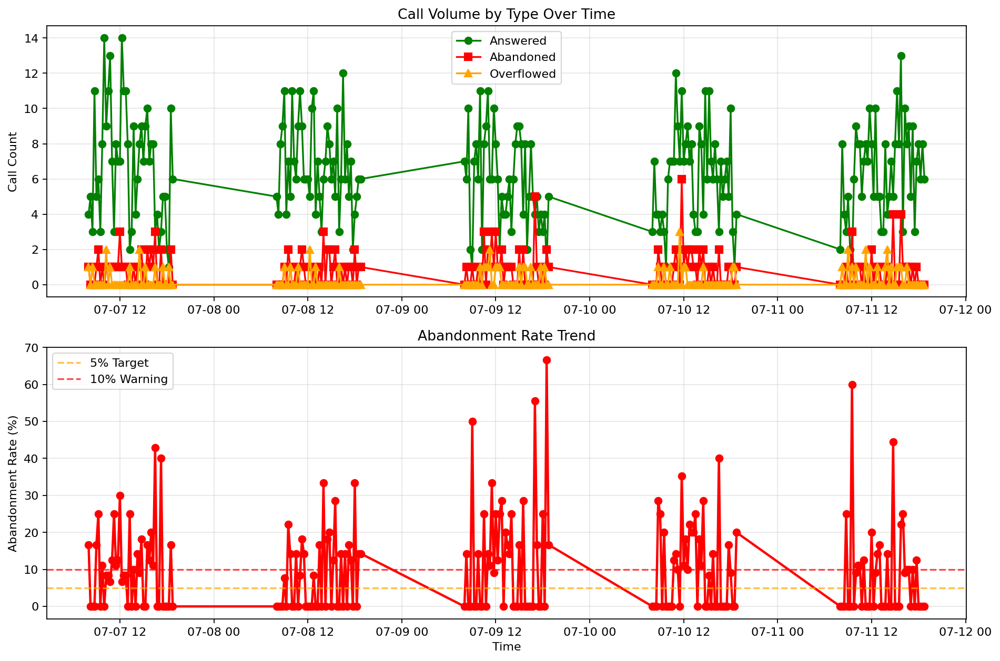
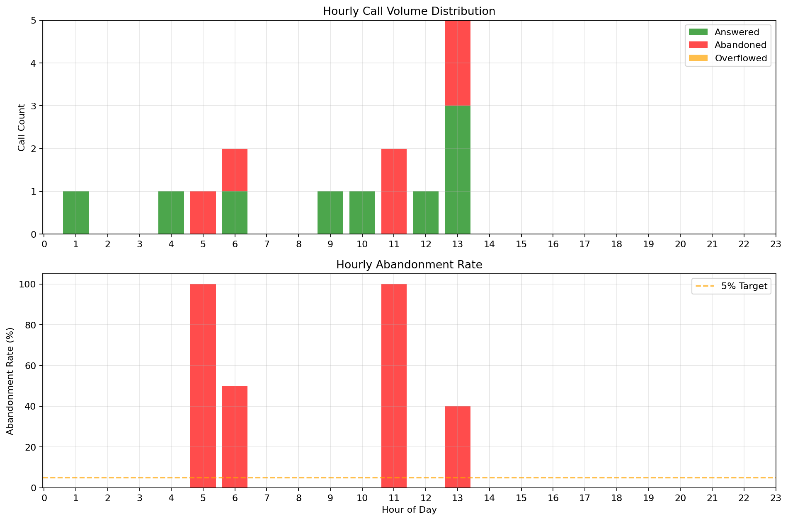
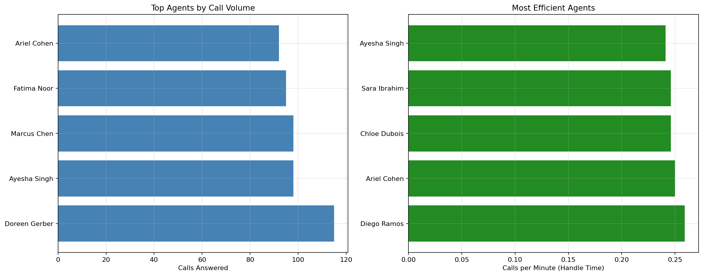

## Executive Summary
### Executive Summary for Call Center Management

1. **Service Level Concerns**: The current answer rate stands at 60%, indicating that only 9 out of 15 calls were answered. This falls short of industry benchmarks, which typically aim for an answer rate of 80% or higher.

2. **High Abandonment Rate**: With an abandonment rate of 40%, 6 out of 15 calls were abandoned by customers before being answered. This suggests significant dissatisfaction and potential loss of business opportunities.

3. **Agent Performance Insights**: The average handle time is 17 seconds, which is efficient; however, the combination of low answer rates and high abandonment suggests that agents may be overwhelmed or that staffing levels are insufficient during peak times.

4. **Wait Time Analysis**: The average wait time of 35 seconds, with a maximum wait time of 1 minute and 33 seconds, indicates that customers are experiencing delays that could lead to increased abandonment rates, especially during peak periods.

5. **Peak and Worst Periods Identification**: The peak call period was identified with 2 calls at 13:30 on July 9, 2025, while the worst abandonment period also had 2 calls at 11:30 on July 16, 2025. These times should be targeted for staffing adjustments and resource allocation.

6. **Actionable Recommendations**: 
   - **Increase Staffing During Peak Times**: Adjust schedules to ensure adequate coverage during identified peak periods.
   - **Implement Call Back Options**: Introduce a call-back feature to reduce abandonment rates and improve customer satisfaction.
   - **Monitor and Train Agents**: Regularly review agent performance metrics and provide targeted training to enhance efficiency and customer interaction quality.
   - **Enhance Self-Service Options**: Develop self-service resources to alleviate call volume and empower customers to resolve simple inquiries independently. 

By addressing these key areas, we can significantly improve service levels, reduce abandonment rates, and enhance overall customer satisfaction.

## Key Performance Indicators

| Metric                   | Value                          |
|--------------------------|--------------------------------|
| Total Calls Offered      | 15                             |
| Calls Answered           | 9 (60.0%)                      |
| Calls Abandoned          | 6 (40.0%)                      |
| Calls Overflowed         | 0 (0.0%)                       |
| Answer Rate              | 60.0%                          |
| Abandonment Rate         | 40.0%                          |
| Overflow Rate            | 0.0%                           |
| Average Wait Time        | 00:35                          |
| Maximum Wait Time        | 01:33                          |
| Average Handle Time      | 00:17                          |
| Peak Call Period         | 2 calls at 2025-07-09 13:30:00 |
| Worst Abandonment Period | 2 calls at 2025-07-16 11:30:00 |

## Service Level Trends

## Hourly Call Patterns

## Service Level by Hour

|   HOUR |   ANSWERED CALLS |   ABANDONED CALLS |   OVERFLOWED CALLS |   TOTAL_OFFERED |   ABANDONMENT_RATE |
|--------|------------------|-------------------|--------------------|-----------------|--------------------|
|      5 |                0 |                 1 |                  0 |               1 |                100 |
|     11 |                0 |                 2 |                  0 |               2 |                100 |
|      6 |                1 |                 1 |                  0 |               2 |                 50 |
|     13 |                3 |                 2 |                  0 |               5 |                 40 |
|      1 |                1 |                 0 |                  0 |               1 |                  0 |
|      4 |                1 |                 0 |                  0 |               1 |                  0 |
|      9 |                1 |                 0 |                  0 |               1 |                  0 |
|     10 |                1 |                 0 |                  0 |               1 |                  0 |
|     12 |                1 |                 0 |                  0 |               1 |                  0 |

## Agent Performance

## Top Agents by Call Volume

| AGENT          |   ANSWERED CALLS |   AVG_HANDLE_TIME |
|----------------|------------------|-------------------|
| Yitzi Wurtzel  |                7 |              21.8 |
| Daniel Leubitz |                1 |              40   |
| Doreen Gerber  |                1 |              36   |

## Most Efficient Agents

| AGENT          |   ANSWERED CALLS |   EFFICIENCY |   AVG_HANDLE_TIME |
|----------------|------------------|--------------|-------------------|
| Yitzi Wurtzel  |                7 |        2.979 |              21.8 |
| Doreen Gerber  |                1 |        1.667 |              36   |
| Daniel Leubitz |                1 |        1.5   |              40   |

