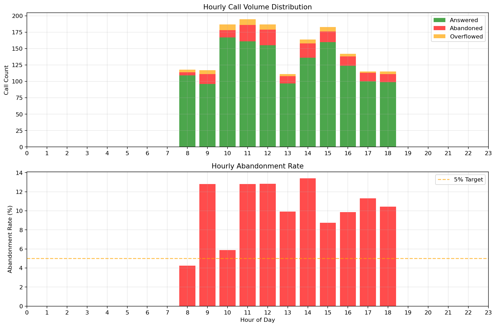

## Executive Summary
### Executive Summary for Call Center Management

1. **Service Level Achievement**: The call center achieved an answer rate of 85.92%, indicating a strong performance in handling incoming calls. However, this falls short of the industry standard of 90%, suggesting room for improvement in service level.

2. **Abandonment Rate Concerns**: The abandonment rate stands at 10.28%, which is higher than the acceptable threshold of 5%. This indicates that a significant number of customers are choosing to hang up before their calls are answered, potentially leading to dissatisfaction and lost business.

3. **Overflow and Peak Periods**: With 3.79% of calls overflowing, it is evident that during peak times, specifically noted at 10:00 AM on July 7, the call center struggles to manage call volume effectively. This can exacerbate the abandonment rate and impact overall customer experience.

4. **Agent Performance Metrics**: The average handle time (AHT) is recorded at 4 minutes and 27 seconds. While this is within a reasonable range, it is essential to analyze individual agent performance to identify training needs and optimize efficiency.

5. **Actionable Recommendations**:
   - **Increase Staffing During Peak Hours**: Adjust staffing levels to ensure adequate coverage during identified peak periods, particularly around 10:00 AM, to reduce wait times and abandonment rates.
   - **Implement Call Back Options**: Introduce a call-back feature for customers who are experiencing long wait times, which can help mitigate abandonment and improve customer satisfaction.

6. **Continuous Monitoring and Training**: Regularly monitor key performance indicators (KPIs) and provide targeted training for agents to improve both efficiency and customer interaction quality. This will help reduce average handle time and enhance overall service delivery. 

By addressing these areas, the call center can improve customer satisfaction, reduce abandonment rates, and enhance overall operational efficiency.

## Key Performance Indicators

| Metric                   | Value                           |
|--------------------------|---------------------------------|
| Total Calls Offered      | 1,634                           |
| Calls Answered           | 1,404 (85.92%)                  |
| Calls Abandoned          | 168 (10.28%)                    |
| Calls Overflowed         | 62 (3.79%)                      |
| Answer Rate              | 85.92%                          |
| Abandonment Rate         | 10.28%                          |
| Overflow Rate            | 3.79%                           |
| Average Wait Time        | 00:52                           |
| Maximum Wait Time        | 03:11                           |
| Average Handle Time      | 04:27                           |
| Peak Call Period         | 14 calls at 2025-07-07 10:00:00 |
| Worst Abandonment Period | 6 calls at 2025-07-10 11:45:00  |

## Service Level Trends

## Hourly Call Patterns

## Service Level by Hour

|   HOUR |   ANSWERED CALLS |   ABANDONED CALLS |   OVERFLOWED CALLS |   TOTAL_OFFERED |   ABANDONMENT_RATE |
|--------|------------------|-------------------|--------------------|-----------------|--------------------|
|     14 |              136 |                22 |                  6 |             164 |              13.41 |
|     12 |              155 |                24 |                  8 |             187 |              12.83 |
|      9 |               96 |                15 |                  6 |             117 |              12.82 |
|     11 |              161 |                25 |                  9 |             195 |              12.82 |
|     17 |              100 |                13 |                  2 |             115 |              11.3  |
|     18 |               99 |                12 |                  4 |             115 |              10.43 |
|     13 |               97 |                11 |                  3 |             111 |               9.91 |
|     16 |              124 |                14 |                  4 |             142 |               9.86 |
|     15 |              160 |                16 |                  7 |             183 |               8.74 |
|     10 |              167 |                11 |                  9 |             187 |               5.88 |

## Agent Performance

## Top Agents by Call Volume

| AGENT         |   ANSWERED CALLS |   AVG_HANDLE_TIME |
|---------------|------------------|-------------------|
| Doreen Gerber |              115 |             258   |
| Ayesha Singh  |               98 |             248.4 |
| Marcus Chen   |               98 |             258.8 |
| Fatima Noor   |               95 |             252.3 |
| Ariel Cohen   |               92 |             247.5 |

## Most Efficient Agents

| AGENT        |   ANSWERED CALLS |   EFFICIENCY |   AVG_HANDLE_TIME |
|--------------|------------------|--------------|-------------------|
| Diego Ramos  |               74 |        0.259 |             233.4 |
| Ariel Cohen  |               92 |        0.25  |             247.5 |
| Chloe Dubois |               88 |        0.246 |             256.2 |
| Sara Ibrahim |               84 |        0.246 |             250.5 |
| Ayesha Singh |               98 |        0.241 |             248.4 |

